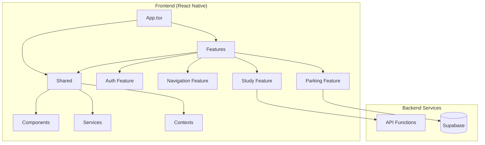

# NavEd - Campus Navigation & Study Assistant

<p align="center">
  <strong>Budget-Friendly Mobile App for University Students</strong><br>
  No IoT devices required • Uses FREE APIs • Accessibility-focused
</p>

[](https://opensource.org/licenses/MIT)
[](https://www.typescriptlang.org/)
[](https://reactnative.dev/)
[](https://expo.dev/)

---

## 📱 About NavEd

NavEd (Smart Campus Navigation and Student Assistance System) is a comprehensive mobile application designed for university students with three main modules:

1. **🗺️ Campus Navigation** - Interactive maps with video-guided routes
2. **🅿️ Parking Guidance** - Crowdsourced availability with smart predictions
3. **📚 Study Assistant** - AI-powered RAG chatbot for document analysis

### Budget-Friendly Design

This app is specifically designed for students on a tight budget:

- ✅ **NO expensive APIs** - Uses free tiers of all services
- ✅ **NO IoT hardware** - Crowdsourced data instead of sensors
- ✅ **NO server costs** - Local storage with optional free cloud
- ✅ **100% Open Source** - React Native + Expo

---

## 🚀 Features

### 1. Campus Navigation Module

| Feature | Description |
|---------|-------------|
| Interactive Map | OpenStreetMap-based campus map (FREE) |
| Video Navigation | Pre-recorded route videos for visual guidance |
| Turn-by-Turn | Voice-guided directions using OSRM (FREE) |
| Room Finder | Search for classrooms, labs, and offices |
| Accessibility Routes | Wheelchair-friendly paths with ramp/elevator info |

### 2. Parking Guidance Module

| Feature | Description |
|---------|-------------|
| Availability Dashboard | Real-time parking lot status |
| Crowdsourced Updates | Users report available spots |
| Smart Predictions | ML-based peak hour forecasting |
| Vehicle Locator | Save and find your parked car |
| Push Notifications | Alerts when lots are filling up |

### 3. Study Assistant System

| Feature | Description |
|---------|-------------|
| Document Upload | Support for PDF, Word, TXT files |
| RAG-based Q&A | Ask questions about your documents |
| Quiz Generation | Auto-generate practice quizzes |
| Study Plans | AI-created study schedules |
| Assignment Help | Task breakdown and guidance |

### 4. Accessibility Features

- 🔊 Voice guidance with adjustable speech rate
- 📳 Haptic feedback for interactions
- 🎨 High contrast mode
- 📏 Adjustable font sizes
- ♿ Screen reader optimized
- 🎯 Large touch targets (WCAG 2.1 AA compliant)

---

## 💰 Cost Breakdown

| Component | Cost | Alternative |
|-----------|------|-------------|
| Maps | FREE (OpenStreetMap) | - |
| Routing | FREE (OSRM) | Self-host for higher limits |
| AI/LLM | FREE tiers available | See below |
| Storage | FREE (Local + Supabase free tier) | - |
| Notifications | FREE (Expo Push) | - |
| **Total** | **$0/month** | - |

### Free AI API Options

1. **Google Gemini** - 60 requests/minute FREE
   - Get key: https://makersuite.google.com/app/apikey

2. **Groq** - Very generous free tier
   - Get key: https://console.groq.com/keys

3. **HuggingFace** - Free inference API
   - Get key: https://huggingface.co/settings/tokens

---

## 🚀 Quick Start

### Prerequisites

- Node.js 18+ (see `.nvmrc`)
- npm or yarn
- Expo CLI (`npm install -g expo-cli`)
- Android Studio (for Android) or Xcode (for iOS)

### Installation

```bash
# Clone the repository
git clone https://github.com/your-repo/naved.git
cd naved

# Install dependencies
npm install

# Copy environment variables template
cp .env.example .env

# Edit .env with your API keys (optional)
# See .env.example for required variables

# Start the development server
npm start

# Run on Android
npm run android

# Run on iOS
npm run ios
```

### Development

```bash
# Run tests
npm test

# Run tests with coverage
npm run test:coverage

# Lint code
npm run lint

# Fix linting issues
npm run lint:fix

# Type check
npm run type-check

# Format code
npm run format

# Validate (type-check + lint + format)
npm run validate
```

### Configuration

1. **Environment Variables**

   Copy `.env.example` to `.env` and fill in:
   - `SUPABASE_URL` and `SUPABASE_ANON_KEY` (optional, for cloud sync)
   - `GEMINI_API_KEY` (optional, for PDF extraction and study features)
   - `GROQ_API_KEY` and `HUGGINGFACE_API_KEY` (optional, alternative LLMs)

2. **Update Campus Data**

   Edit `frontend/shared/data/campusData.ts` with your university's:
   - Building coordinates
   - Room information
   - Parking lot locations

3. **Add Video Routes** (Optional)

   Place MP4 videos in `assets/videos/` following the naming convention:
   ```
   route_gate_to_mab.mp4
   route_gate_to_library.mp4
   ```

---

## 📁 Project Structure

```
NavEd/
├── frontend/               # React Native mobile app
│   ├── app/                # App entry point
│   │   └── App.tsx         # Root component
│   ├── features/           # Feature-based modules
│   │   ├── auth/           # Authentication
│   │   ├── navigation/     # Campus navigation
│   │   ├── parking/        # Parking guidance
│   │   └── study/          # Study assistant
│   └── shared/             # Shared code
│       ├── components/     # Reusable components
│       ├── contexts/       # React contexts
│       ├── services/       # Shared services
│       ├── types/          # TypeScript types
│       └── utils/          # Utilities
├── backend/                # Backend services
│   ├── api/                # Serverless functions
│   ├── database/           # Database migrations
│   └── scripts/            # Utility scripts
├── __tests__/              # Test files (mirrors frontend/)
├── assets/                 # Static assets
└── docs/                   # Documentation
```

### Architecture



See [STRUCTURE.md](STRUCTURE.md) for detailed structure documentation.

---

## 🎓 For Your FYP

### Customizing for Your University

1. **Campus Map**
   - Get your campus coordinates from Google Maps
   - Update `CAMPUS_CONFIG` in `src/utils/constants.ts`
   - Add building data in `src/data/campusData.ts`

2. **Recording Video Routes**
   - Walk the routes while recording with your phone
   - Keep videos under 2 minutes for smooth playback
   - Use 720p to balance quality and file size

3. **Parking Data Collection**
   - Survey your campus parking lots
   - Note peak hours from observation
   - Add accessibility information

### Presentation Tips

- Demo the accessibility features (impressive for evaluators!)
- Show the cost comparison with commercial solutions
- Highlight the crowdsourced data science approach
- Demonstrate offline capability

---

## 🔧 Technical Details

### Technologies Used

| Category | Technology | Why |
|----------|------------|-----|
| Framework | React Native + Expo | Cross-platform, fast development |
| Maps | react-native-maps + OpenStreetMap | Free, detailed maps |
| Routing | OSRM | Free, open-source routing |
| AI/LLM | Gemini/Groq/HuggingFace | Free tiers available |
| Storage | AsyncStorage | Local, no server needed |
| Navigation | React Navigation | Standard for RN apps |
| Icons | Expo Vector Icons | Comprehensive icon set |

### Key Design Decisions

1. **No Backend Server**
   - All data stored locally on device
   - Reduces hosting costs to $0
   - Works offline

2. **Crowdsourced Parking**
   - Users report availability
   - Builds community engagement
   - No expensive IoT sensors

3. **RAG without Embeddings API**
   - Keyword-based retrieval
   - Works with any free LLM
   - No vector database needed

---

## 📄 License

MIT License - Feel free to use for your FYP!

---

## 🤝 Contributing

We welcome contributions! Please see [CONTRIBUTING.md](CONTRIBUTING.md) for guidelines.

### Development Workflow

1. Fork the repository
2. Create a feature branch (`git checkout -b feature/amazing-feature`)
3. Make your changes
4. Run tests and linting (`npm run validate`)
5. Commit your changes (`git commit -m 'Add amazing feature'`)
6. Push to the branch (`git push origin feature/amazing-feature`)
7. Open a Pull Request

See [CONTRIBUTING.md](CONTRIBUTING.md) for detailed guidelines.

---

<p align="center">
  Made with ❤️ for students, by students<br>
  <strong>NavEd - Navigate. Park. Study. Succeed.</strong>
</p>
